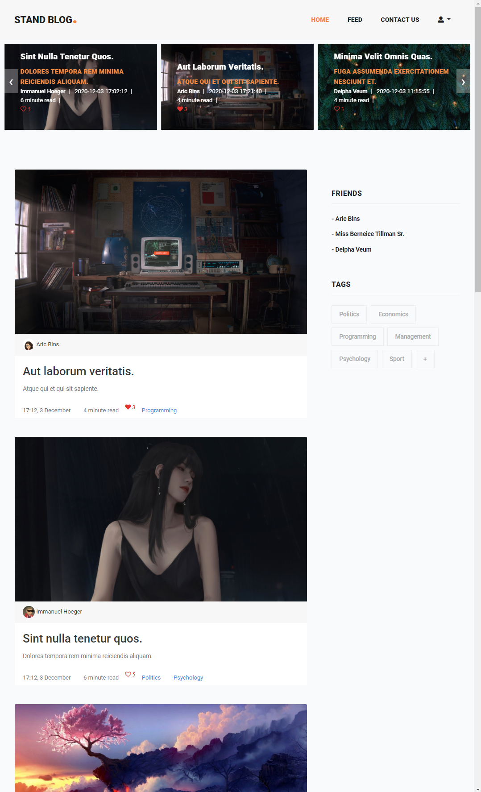

# Blog in Laravel
> Blog for social journalism

## Table of contents
* [General info](#general-info)
* [Technologies](#technologies)
* [Setup](#setup)
* [Features](#features)
* [Status](#status)
* [Contact](#contact)

## General info
Blog for  social journalism
The main reason for creating this project is learning Laravel by implementation and practice of new knowledge. 

## Technologies
* Laravel: 7.4.5
* Bootstrap: 4.0

## Setup
Run it on your local machine or you can check the [demo version on Heroku](http://blog-in-laravel.herokuapp.com/)

## Features
#### List of features:
* **Articles** 
    * **C**reate, **R**ead, **U**pdate, **D**elete functionality for all articles
    * Tags and likes for articles
    * Minute to read functionality (library)
* **Tags** 
    * **C**reate, **R**ead, **U**pdate, **D**elete functionality for all tags
    * Many-to-many relationship with articles  
* **Users** 
    * Authentication 
    * Subscription (to other users)
    * Editing your personal info, adding status or image
    * Feed (shows articles from users that you subscribed)
* **REST API**

#### Working on / Future plans:
* Roles (such as admin, moderators, users, guests)
* Improved likes functionality
* Dynamic search 

## Status
Project is: _in progress_

## Contact
Created by [Dilmurod Ruziev](tg://resolve?domain=Dilmurod_RD) - feel free to contact me!
